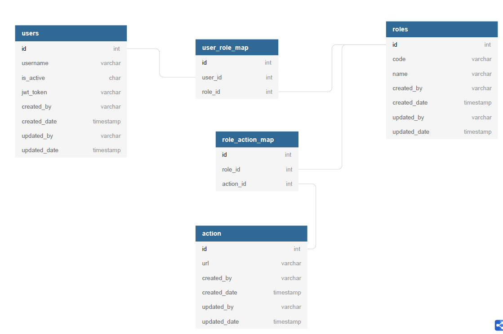

## User - Role - Action Table Desing with Hibernate Envers(Auditing) Example

#### Abstract
* Auditing needs for history of transactions.
* Contains an example hibernate envers ops.
* I have provided an example user-role-action definition:

  

* Finally, There is have an example auditing with archive schema.
* Always store it auditing tables into the another schema. It is recommended!

  

### Guides
The following guides illustrate how to use some features:

* [Docs of Envers](https://docs.jboss.org/envers/docs/)
* [Envers example 1](http://progressivecoder.com/setting-hibernate-envers-spring-boot/)
* [Envers example 2](https://www.baeldung.com/database-auditing-jpa)
* [Docs of Auditing](https://docs.spring.io/spring-data/jpa/docs/current/reference/html/#auditing)
* [Auditing example 1](https://dzone.com/articles/spring-data-jpa-auditing-automatically-the-good-stuff)
* [Auditing example 2](http://progressivecoder.com/spring-boot-jpa-auditing-example-with-auditoraware-interface/)
